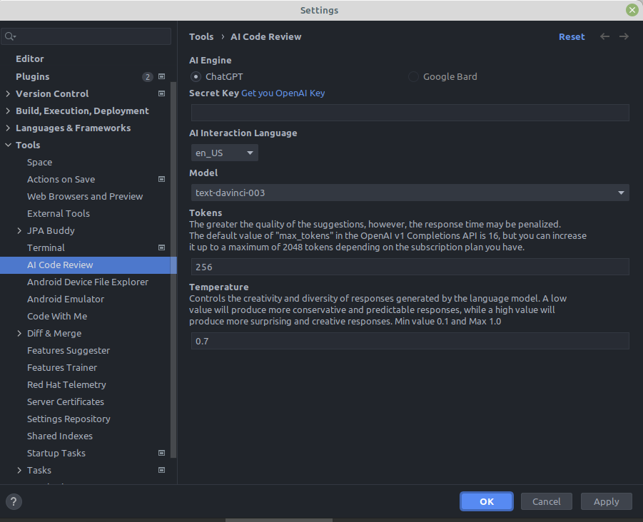
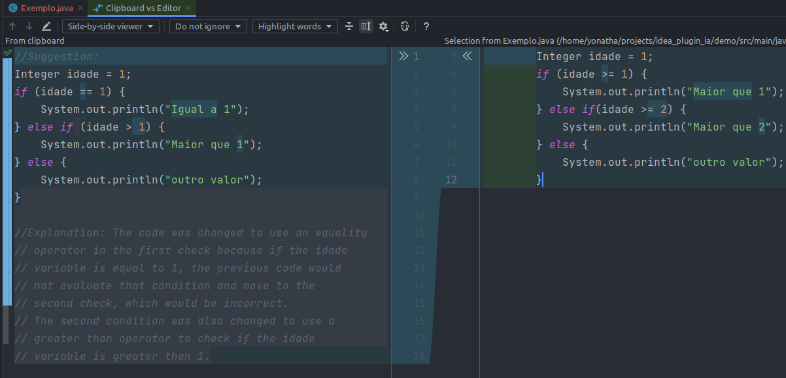

# AI Code Review

Improve code quality through code reviews utilizing artificial intelligence such as ChatGPT, Google Bard and other emerging AI technologies in the market. These tools can help in identifying potential issues, improving code readability, and enhancing overall software functionality. By utilizing these AI capabilities, developers can streamline their code review processes and ensure their code is of the highest quality.
  
<b>Features:</b>
<ul>
    <li>Support to code review any programming language</li>
    <li>Parameterize the accuracy of code suggestions</li>
    <li>Optimize time based on your needs</li>
    <li>Language preference for AI messages (English, Spanish and Portuguese)</li>
    <li>Compatible with all Jetbrains family products.</li>
</ul>
 
<b>Coming soon:</b>
<ul>
    <li>Google Bard Support</li>
    <li>Connection test in plugin configuration screen</li>
    <li>Validation of configuration screen fields</li>
</ul>

AI Code Review Settings
 

 
 
Select code to review
 

 
 
Learn from AI suggestions
 

<h3>Usage</h3>
<ul>
    <li>1. Access the main menu <b>File</b> -> <b>Settings</b> or press <b>Ctrl+Alt+S</b></li>
    <li>2. Go to <b>Tools</b> -> <b>AI Code Review</b></li>
    <li>3. Insert your OpenAI API Key into the <b>Secret Key</b> field (generate your key here <a href="https://platform.openai.com/account/api-keys">https://platform.openai.com/account/api-keys</a></li> 
    <li>4. Select the code suggestion language in the <b>AI Interaction Language</b> field</li>
    <li>5. Click <b>Ok</b> </li>
    <li>6. Great! Open a file containing the code you want to review</li>
    <li>7. Select the code snippet and click on the <b>Code</b> -> <b>AI Code Review</b> menu, or right-click and then select </b>AI Code Review</b> in context menu</li> 
    <li>8. Wait while the AI performs the code review</li>
    <li>9. Check the results and suggestions in the IDE's native clipboard window</li>
    <li>10. Enjoy!</li>
</ul>